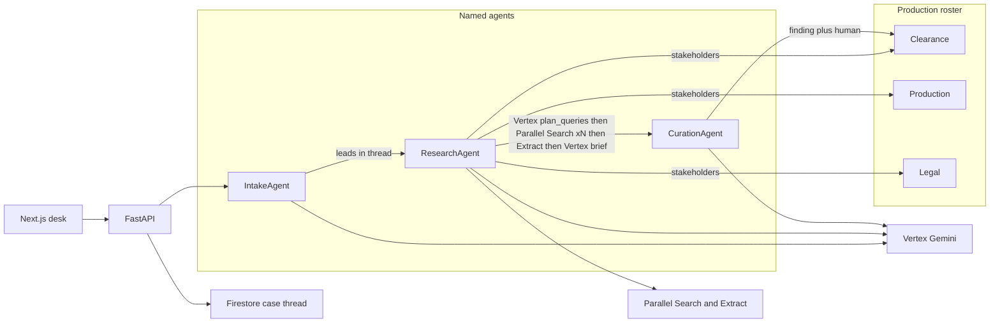

# RightsRadar

RightsRadar is a hosted-app foundation for the Google Cloud Agentic Cinema Hackathon — Parallel
Track. It helps production teams research possible rights-clearance concerns in scripts and assets.
It is research assistance only: it does not provide legal advice or make final infringement
determinations.

The production workspace accepts script text plus PDF, DOCX, PNG, JPEG, and WebP production files.
Gemini identifies rights-clearance research leads from text, document layout, and imagery; each
lead is converted into a text research objective for Parallel Search and Extract. The resulting
case keeps traceable web evidence and lets a reviewer dismiss or escalate each finding.

Analyzed files are limited to 10 MiB and are stored privately with their case. DOCX text is
extracted server-side; PDF and image files retain Gemini's visual and layout context. Parallel does
not accept local file uploads or return image results, so it researches Gemini's detected text
leads against web pages. Reviewers can also attach UTF-8 plain-text script sides, continuity or
clearance notes, prop/product-placement logs, character or likeness notes, and quote/music-cue
lists up to 256 KiB without analyzing them. The browser exposes only asset metadata.

Each production can configure up to 50 case-insensitive whole-phrase ignore entries. Matching
detected items are removed before Parallel research to suppress studio-owned or otherwise expected
references without changing existing findings. Production cards support private PNG, JPEG, or WebP
icons up to 512 KiB.

Each production has a roster of real people (clearance, production, legal). Analysis opens a
**case desk thread** where named agents and those people pass work:

1. **IntakeAgent** (Vertex Gemini) detects leads and @mentions Research.
2. **ResearchAgent** attaches roster stakeholders, then for each lead: Vertex `plan_queries`
   (2–3 objectives), Parallel Search once per objective, Parallel Extract on the merged URL set,
   and Vertex `brief_stakeholders`. Clearance is always attached; production joins brand and
   franchise leads; legal joins likeness, quotes, music, and character leads.
3. **CurationAgent** (Vertex Gemini `curate_evidence`) cites only extracted URLs, or refuses a
   source, and @mentions the same stakeholders for accept / dismiss / escalate.

Humans reply in the same thread as a selected roster member. The thread is stored on the case
(Firestore in cloud mode, in-memory in mock). Mock fixtures stay labeled as fixtures.

## Requirements

- Node.js 20.9+ and `pnpm` 10
- Python 3.11+ and `uv`
- Docker (optional, for containers)

## Setup and development

```bash
cp .env.example .env
make setup
make dev
```

Open <http://127.0.0.1:3000>. `make dev` starts FastAPI with reload on port 8000 and Next.js with
hot reload on port 3000. The default `RIGHTSRADAR_MODE=mock` uses in-memory repositories and
deterministic Gemini/Parallel fixtures, so no API keys or cloud credentials are needed.

## Commands

```bash
make setup            # install JavaScript/Python dependencies, generate client, install Chromium
make dev              # start API and web app with hot reload
make lint             # Ruff and ESLint
make typecheck        # mypy and TypeScript
make test             # pytest and Vitest
make generate-client  # regenerate the typed client from FastAPI OpenAPI
make check-client     # regenerate and fail if the committed client changed
make build            # build Python distribution and Next.js production app
make e2e              # mocked Playwright workflow
make smoke-real       # opt-in smoke path; skips unless explicitly enabled
make reconcile-assets # explicit cleanup of incomplete private asset records; skips by default
```

For containers, run `docker compose up --build`. The compose setup remains in mock mode unless
you explicitly set other environment values.

## Architecture



```text
apps/web/                  Next.js App Router UI
services/api/app/
  agents/                  Intake, Research, Curation plus desk orchestration
  integrations/            GeminiClient and ParallelSearchClient adapters
  repositories/            CaseRepository and AssetRepository adapters
  routes/                  Thin FastAPI HTTP routes
  models/                  Pydantic domain and request models
packages/api-client/       Generated TypeScript client from FastAPI OpenAPI
tests/e2e/                 Mocked browser workflow
infra/terraform/           No-resource Terraform foundation
```

FastAPI's OpenAPI document is the contract source of truth. `scripts/generate_api_client.py`
loads it and deterministically writes `packages/api-client/src/generated.ts`; CI runs
`make check-client` to reject stale generated output. API routes only coordinate HTTP concerns;
the agent, integrations, and persistence sit behind small interfaces.

## Environment modes

`RIGHTSRADAR_MODE` controls defaults:

| Mode | Gemini | Parallel | repositories |
| --- | --- | --- | --- |
| `mock` (default) | deterministic fixture | deterministic fixture | in-memory |
| `hybrid` | each `*_MODE` selects `mock` or `real` | independently selected | independently selected |
| `cloud` | Vertex AI Gemini | Parallel Search and Extract APIs | Firestore and Cloud Storage |

Set `RIGHTSRADAR_MODE=hybrid` and any of `RIGHTSRADAR_GEMINI_MODE`,
`RIGHTSRADAR_PARALLEL_MODE`, or `RIGHTSRADAR_REPOSITORY_MODE` to `real` to enable only that
adapter. Set `RIGHTSRADAR_MODE=cloud` to enable all real integrations. The real Gemini adapter
uses Application Default Credentials (ADC) with Vertex AI; it follows the current
[Google Gen AI SDK for Vertex AI](https://cloud.google.com/vertex-ai/generative-ai/docs/sdks/overview).
The Parallel adapter uses its documented [Search API](https://docs.parallel.ai/api-reference/search/search)
and [Extract API](https://docs.parallel.ai/api-reference/extract/extract) with
`RIGHTSRADAR_PARALLEL_API_KEY` only on the server. No secret is exposed to the browser or written
to logs.

### Verified research pipeline

Gemini first detects distinct research leads and includes enough local scene context to disambiguate
each one. RightsRadar then processes independent leads concurrently, bounded by
`RIGHTSRADAR_PARALLEL_MAX_CONCURRENCY` (default `4`, max 4 concurrent leads). Each lead uses one
provider session prefix `rightsrader:{case_id}:{index}` and runs:

1. Vertex `plan_queries` — schema-constrained JSON list of 2–3 short search objectives (temperature 0).
2. Parallel Search **once per objective** (`advanced` mode, scene context, configured Gemini model
   as `client_model`). Max 3 objectives per lead. These are real Search calls, not a padded batch.
3. URL normalization and deduplication across those searches (at most ~8 URLs, extract cap ~8k chars).
4. One Parallel Extract request for the merged shortlist. Extract may partially succeed, but a lead
   fails safely when none of its shortlisted pages can be verified. Extract does not run before Search
   returns candidates.
5. Vertex `brief_stakeholders` — 3–5 sentences, citations only from extracted excerpts.
6. A schema-constrained Gemini `curate_evidence` pass that selects one extracted URL with a relevance
   rationale or returns a neutral no-source result. Invented URLs are rejected.

The server validates that Gemini selected an extracted candidate, preserves detector order after
concurrent processing, and creates the Firestore case only after every lead succeeds. Provider
failures return a generic retryable response without provider bodies, credentials, or partial case
data. The default mock mode follows the same contract without making network calls.

### Judges: start here

RightsRadar is a rights-clearance research desk, not a chatbot. Three named agents run on each
case (Intake and Curation on Vertex Gemini; Research on Vertex `plan_queries` / `brief_stakeholders`
plus Parallel Search xN + Extract). Real roster members sit in the same thread. Curation cannot
invent a URL that Extract did not return. There is no Agent Engine box and no Cloud Tasks queue.

**Mock vs cloud:** `make dev` defaults to `RIGHTSRADAR_MODE=mock` with labeled fixtures
(`example.com` URLs, phrases like “Nimbus Soda”, tool-call chips marked `fixture`). Playwright
e2e uses mock and must not be narrated as live web research. A live demo must use
`RIGHTSRADAR_MODE=cloud` with ADC and `RIGHTSRADAR_PARALLEL_API_KEY` so findings cite real pages.

Stakeholder mapping is deterministic: clearance always; production on brand/franchise/location;
legal on likeness/quote/music/character. Missing roles are skipped — no invented people.

Each case stores a judge-visible tool-call log (every Vertex Gemini and Parallel Search/Extract
call, with duration, fixture vs live, and success/fail). The case desk renders **tool-call chips
under the relevant agent messages** and keeps the JUDGE LOG dump. The API process prints
structured `tool_call case_id=... provider=... method=...` lines to stdout (Cloud Logging in
cloud). Summaries never include secrets or provider response bodies.

### Demo: end to end (8–10 min)

The first screen asks whether to **walk The Matrix homage** or **work the desk yourself**. The
choice is stored in `localStorage` (`rightsrader.demo.choice`) so a refresh does not nag; use the
sidebar **Demo** control to reopen the chooser or run the homage again. Walkthrough always opens
The Matrix rooftop homage (franchise **and** “There is no spoon”) so two Research lanes fire. It
does not re-analyze on every later load.

**Clicks:**

1. Open the app. Choose **Walk The Matrix homage**, or **I’ll work the desk myself** then
   **New production**.
2. Roster defaults: **Jordan** (clearance), **Alex** (production), **Maya** (legal). Keep those
   three names if you will narrate them.
3. If self-serve: **Create**, **New case**, paste the Matrix homage (franchise + quote) or the
   two-lane skywalk scene. Optional: attach a still/PDF so Intake makes a from-file Vertex call.
4. **Analyze script**. Watch the case desk: Intake Vertex → Research @stakeholders →
   `plan_queries` → Parallel Search xN → Extract → stakeholder brief → Curation Vertex.
5. Speak as **Jordan**. Dismiss a studio-owned hit if you filed skywalk. Speak as **Maya**.
   Escalate the quote and assign a roster member.
6. Cloud only: open one live Parallel URL in a tab. Show `GET /health` `mode: cloud` and one
   Vertex chip plus one Parallel chip that are **not** marked fixture.

**Expected tool-call counts for the two-lead script** (count chips or JUDGE LOG):

| Call | Minimum on a two-lead script |
| --- | --- |
| Intake Vertex (`identify_material` or from-file) | ≥1 |
| `plan_queries` | ≥2 |
| Parallel `search` | ≥4 |
| Parallel `extract` | ≥2 |
| `brief_stakeholders` | ≥2 |
| `curate_evidence` | ≥2 |

Mock chips are labeled `fixture` and cite `example.com`. Do not claim those URLs are live
Parallel results. Pre-flight the CLOUD script the morning of; keep a recorded backup of that
same cloud run (real URLs, not `example.com`). Playwright walks this path in mock.

### Repository-only hybrid smoke setup

Use this non-secret configuration when you want to exercise only Firestore and Cloud Storage while
keeping Gemini and Parallel deterministic mocks:

```bash
RIGHTSRADAR_MODE=hybrid
RIGHTSRADAR_REPOSITORY_MODE=real
RIGHTSRADAR_GOOGLE_CLOUD_PROJECT=<project-id>
RIGHTSRADAR_FIRESTORE_COLLECTION=rightsrader_cases
RIGHTSRADAR_CLOUD_STORAGE_BUCKET=<private-bucket-name>
```

Leave `RIGHTSRADAR_GEMINI_MODE` and `RIGHTSRADAR_PARALLEL_MODE` unset (or set them to `mock`) for
this repository-only smoke run. Authenticate locally with Application Default Credentials (ADC),
then set `RIGHTSRADAR_ENABLE_REAL_SMOKE=true` only when you deliberately intend to contact the
configured repositories. `make smoke-real` creates a UUID-scoped disposable case and short
`text/plain` asset, reads its metadata and bytes, verifies the case asset count, then attempts to
delete the asset before the case. Any cleanup failure is reported. It does not call Gemini or
Parallel. With the default environment, it prints a skip message and makes no external calls.

### Private asset lifecycle reconciliation

Real asset storage first creates a zero-byte private Cloud Storage marker with an exact GCS
generation precondition. It records that marker generation in a single atomic Firestore batch that
creates both the `pending` asset record and its lifecycle index. Content upload must match the
saved marker generation, so a reconciliation deletion that wins makes a delayed upload fail rather
than creating untracked bytes. The resulting content generation is also private persisted metadata
through `ready` and `cleanup_pending`. Every cleanup delete uses that exact GCS generation
precondition; if it changes, the private lifecycle record remains for a later manual review rather
than deleting by object name. A short writer lease still prevents normal active uploads from being
claimed; `ready` promotion also requires the same lease. Only `ready` assets are available through
the application API. Cleanup first fences a `ready` record into private `cleanup_pending` before
touching its bytes, so a missing object never leaves a public record exposed.

Incomplete records are indexed only in a private lifecycle collection derived from the configured
case collection. Reconciliation reads that scoped namespace rather than a project-wide Firestore
collection group. It can claim an expired writer lease or a cleanup record; it also scans only the
unambiguous private RightsRadar marker prefix for a marker left behind by a failed Firestore batch.
It never scans ready objects or unrelated prefixes. A writer that has lost its lease checks
ownership before upload and, even in the final interleaving window, cannot publish untracked bytes
because its GCS generation fence has been removed or changed. When failed promotion leaves no
saved content generation, reconciliation first verifies immutable private RightsRadar case, asset,
and writer metadata, saves the observed generation to the cleanup record transactionally, and only
then attempts its conditional delete.

Reconciliation is deliberately manual: it is not a queue or background task. With real
repositories selected and ADC configured, set `RIGHTSRADAR_ENABLE_RECONCILIATION=true`, then run:

```bash
make reconcile-assets
```

The command retries cleanup for at most 100 incomplete records and prints only aggregate removed
and failed-record counts. It exits nonzero if any record fails, without exposing bucket, object,
project, credential, or provider-error details. It does not create agents or contact Gemini or
Parallel. Without both the explicit flag and real repository mode, it safely skips without
contacting cloud services.

## Testing and quality gates

- `pytest` covers case creation and persisted reviewer status updates.
- `Vitest` checks the generated client request contract.
- `Playwright` submits the original fictional sample, checks cited evidence, and dismisses a
  finding through the API.
- GitHub Actions runs linting, unit tests, type checks, generated-client freshness, builds, and
  the mocked browser workflow for every pull request.

## Current scope and next milestone

This foundation intentionally excludes authentication, payment, queues, deployment automation,
media analysis, and final legal decisions. The recommended next milestone is a labeled Gemini and
Parallel evaluation harness with a human-review quality rubric, followed by an asynchronous
Parallel Task API escalation path for ambiguous or reviewer-escalated leads.
